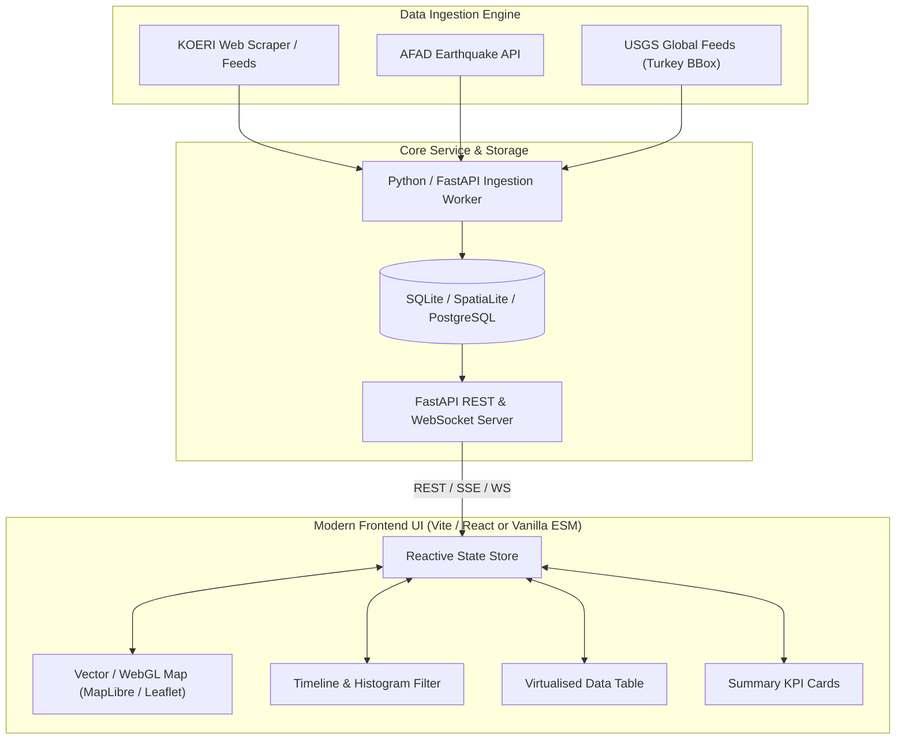

# Product Requirements Document (PRD)
## TEMAS: Turkey Earthquake Monitoring & Analysis System (Modernization)

---

## 1. Executive Summary & Background

### 1.1 Origin & Purpose
**TEMAS** (*Turkey Earthquake Monitoring and Analysis System*) was initiated in February/March 2023 following the catastrophic Kahramanmaraş earthquakes in Turkey and Syria. The project's mission was to collect, parse, persist, and visualize earthquake activity across Turkey in near-real-time to assist researchers, affected communities, and humanitarian observers.

### 1.2 Current State (v0.8.0, March 2023)
The current repository represents an early-stage prototype combining Python web scrapers, SQLite persistence, and static HTML generation (via Folium and jQuery DataTables) served through an Nginx container. While functional as a proof of concept, the architecture suffers from technical limitations:
- **Iframe-based UI**: Standalone static HTML documents loaded into an `<iframe>`, preventing cohesive state management, URL routing, and seamless mobile responsiveness.
- **Monolithic batch generation**: Python script compiles multi-megabyte HTML files on disk on every run instead of exposing lightweight JSON endpoints.
- **Third-party dependency breakage**: Folium relies on Stamen tiles (`Stamen Terrain`, `Stamen Toner`), which were deprecated and shut down for open public access in mid-2023.
- **Docker & scheduler friction**: Mismatched paths and missing pip requirements in the Docker image, requiring manual host-level cron setups.

### 1.3 Modernization Vision (TEMAS 2.0)
Transform TEMAS into a sleek, production-grade, responsive Earthquake Monitoring and Spatial Intelligence platform. It will feature real-time multi-source data ingestion (KOERI, AFAD, USGS, EMSC), high-performance client-side rendering (MapLibre GL / Leaflet / Cesium), interactive filtering and timeline playback, and responsive modern UI aesthetics without heavy iframe nesting.

### 1.4 Production Delivery Status (TEMAS v2.10.4, September 2026)
As of September 2026, the TEMAS platform has fully achieved its modernization objectives and operates as an integrated seismic observatory:
- **Production Release**: `v2.10.5`
- **Data Catalog**: Continuous 2021–2026 multi-year archive with over 13,400 verified seismic records ($M \ge 2.0$).
- **Zero Iframes**: Unified Single Page Application with GPU-accelerated Leaflet HTML5 Canvas rendering.
- **Resilient Multi-Agency Ingestion**: Asynchronous multi-tier pipeline (KOERI, EMSC, USGS) with composite unique deduplication.
- **Adaptive Timeline Playback**: Fast 1-Year default temporal window (~1,600 events) with adaptive chronological animation across any selected filter scope (including full 2021–2026 playback).
- **Full-Spectrum Day/Night Theme Synchronization**: Dynamic basemap-linked theme switching between CartoDB Dark Matter and OpenStreetMap Light.
- **Hardened Operations Deck**: Concealed `/samet` administrative interface with deceptive 404 decoy on `/admin` and dynamic SQLite-backed passkey management.
- **Mobile Dual-Nav Ergonomics**: Responsive mobile layout with Left Feed Drawer and Right 9-Dot Bento Tools Grid.

---

## 2. Legacy Codebase Audit & Inspection Findings

| Dimension | Legacy Implementation (v0.8.0) | Observation & Technical Debt |
| :--- | :--- | :--- |
| **Data Ingestion** | `app-updater.py` scrapes `lasteq.asp` and `sc3.koeri.boun.edu.tr` HTML tables with `requests` + `BeautifulSoup`. | Fragile to KOERI HTML layout changes; lacks backoff/retries; no multi-source fallback (e.g. AFAD or USGS). |
| **Data Storage** | SQLite (`data/eq-turkey.db`, table `quaketk` with 2,296 records). | Stores strings and numbers without spatial indexes (GeoPackage/SpatiaLite); no automated migrations. |
| **Map Rendering** | Folium Python library saving static HTML files (`map_bubble_koeri.html`, `map_heat_koeri.html`). | Generates 1.3MB+ files per run with embedded Leaflet script and Stamen tiles (now defunct/require Stadia keys). |
| **Table View** | `pretty_html_table` and jQuery `DataTables` dumping 3.7MB static tables (`table_interact_koeri.html`). | Heavy DOM overhead, no server-side pagination, high initial page weight. |
| **Frontend Shell** | `web/index.html` with Bootstrap 4 navbar and an `<iframe>`. | Poor mobile UX, zero cross-component interactivity (e.g. clicking a map circle does not filter or highlight in the table). |
| **Containerization** | `Dockerfile` based on `nginx:stable` attempting to run `cron` and Python 3. | Missing pip packages (`folium`, `branca`, `pandas`), path discrepancies (`/usr/local/bin/python` in cron vs `/usr/bin/python3`). |

---

## 3. Product Goals & Personas

### 3.1 Key Objectives
1. **Low Latency & High Resilience**: Ingest seismic events within 60 seconds of publication from primary (KOERI) and secondary (AFAD, EMSC) sources.
2. **Unified Geospatial Dashboard**: Replace disconnected iframes with an integrated single-page interface linking the map, chronological timeline, seismic depth charts, and search table.
3. **Interactive Analysis**: Filter events dynamically by magnitude range ($\ge 3.0, 4.0, 5.0+$), depth, date window, fault line proximity, and administrative provinces.
4. **Mobile First & High Polish**: Deliver 60fps interaction on mobile devices and desktops with dark-mode aesthetic, micro-animations, and responsive layouts.

### 3.2 Target Personas
- **The Concerned Resident / Diaspora**: Wants immediate, easy-to-read magnitude, location, and felt-intensity info on mobile during or after an event.
- **The Disaster / Humanitarian Volunteer**: Needs quick historical context, aftershock frequency trends, and cluster heatmaps to understand affected zones.
- **The Data Analyst / Geoscientist**: Needs raw data export (CSV/GeoJSON), plate boundary overlays, depth vs. magnitude scatter plots, and fault line analysis.

---

## 4. Architecture & System Design



### 4.1 Component Breakdown

#### 1. Ingestion Pipeline & Background Worker
- **Multi-source Adapter**: Primary adapter for KOERI (Kandilli), secondary for AFAD (Disaster and Emergency Management Authority of Turkey), and USGS as international fallback.
- **Data Normalization**: Schema standardizing event time (UTC and TRT/GMT+3), epicenter coordinates, focal depth (km), magnitude types ($M_L, M_w, M_d$), and province/district tagging.
- **Deduplication Engine**: Geospatial distance ($\le 25\text{ km}$) and time window ($\pm 60\text{ s}$) matching to merge multi-source detections into a single canonical event.

#### 2. Persistence Layer
- SQLite with WAL (Write-Ahead Logging) or PostgreSQL with PostGIS for production.
- Spatial index on coordinates and B-Tree indexes on `origintimeutc` and `magnitude`.
- Retain tectonic boundary GeoJSON (`PB2002_boundaries.json`) and Turkey administrative boundaries (`geoboundaries-TUR-ADM1_simplified.json`).

#### 3. API & Serving Layer
- Lightweight FastAPI or Flask backend providing:
  - `GET /api/v1/earthquakes`: Filterable by `min_mag`, `max_mag`, `start_date`, `end_date`, `bbox`, `limit`, `offset`.
  - `GET /api/v1/earthquakes/stats`: Aggregated metrics (total count, energy release, distribution by magnitude, active regions).
  - `GET /api/v1/boundaries/tectonic`: GeoJSON stream for fault lines and plate boundaries.
  - `GET /api/v1/boundaries/provinces`: GeoJSON for Turkish administrative divisions.
  - `GET /api/v1/live` (Optional): Server-Sent Events (SSE) or WebSockets for live push notifications when a new event is registered.

#### 4. Frontend Client
- Standalone SPA (Single Page Application) without iframes.
- Modern vector basemap (Carto Dark / Positron, OpenStreetMap, or MapLibre vector tiles with free OpenMapTiles / Stadia / Stamen replacement).
- Responsive split-view: Collapsible sidebar with real-time feed cards, main interactive map with depth/magnitude color scales, bottom timeline drawer.

---

## 5. Functional Requirements

### 5.1 Ingestion & Processing
- **FR-01**: Ingestion worker must query source feeds on an automated schedule (e.g. every 2–5 minutes).
- **FR-02**: Automatic retry mechanism with exponential backoff on HTTP timeouts or network failures.
- **FR-03**: Validate and clean incoming coordinates, stripping degree characters and correcting timezone offsets.
- **FR-04**: Preserve existing legacy historical records (from Jan 16, 2023) while streaming newly ingested quakes.

### 5.2 Interactive Map
- **FR-05**: Dynamic circle markers with radii scaled by exponential seismic magnitude formula: $r = f(M)$ or Richter energy equivalence.
- **FR-06**: Color ramp representing depth (e.g., shallow $<10\text{ km}$ red/orange vs deep $>30\text{ km}$ purple) or magnitude ($<3.0$ green, $3.0\text{–}5.0$ amber, $\ge 5.0$ red).
- **FR-07**: Tectonic boundary layer toggle displaying major fault lines (North Anatolian Fault, East Anatolian Fault, Aegean-Anatolian plate boundaries).
- **FR-08**: Smooth clustering for high-density historical events to prevent browser sluggishness.
- **FR-09**: Heatmap toggle layer with adjustable blur, radius, and intensity weights.

### 5.3 Data Exploration & Filtering
- **FR-10**: Real-time magnitude range slider ($0.0 \to 8.0+$).
- **FR-11**: Date & time range picker with quick presets: *Last 24 Hours*, *Last 7 Days*, *Kahramanmaraş Sequence (Feb 2023)*, *All Time*.
- **FR-12**: Full-text search on regional names (e.g. "Hatay", "Kahramanmaraş", "Malatya", "Marmara").
- **FR-13**: Bidirectional selection: Clicking an event in the table flies the map camera to the epicenter; clicking a map marker highlights and scrolls to the table entry.

### 5.4 Analytics & Reporting
- **FR-14**: KPI counter cards showing:
  - Total events recorded
  - Largest quake in selected window
  - Average depth
  - Events in the past 24 hours
- **FR-15**: Magnitude frequency histogram (Gutenberg-Richter distribution curve).
- **FR-16**: One-click data export in CSV and GeoJSON formats.

---

## 6. Non-Functional Requirements

- **Performance**: Initial web bundle size $<500\text{ KB}$ gzipped; map canvas initial load $<1.5\text{s}$; table rendering using virtual DOM / virtual scrolling for $10,000+$ items.
- **Reliability & Uptime**: Graceful degradation if KOERI scraping fails (displaying last cached update timestamp and fallback banner).
- **Accessibility & UX**: Fully accessible dark-mode UI with high-contrast color palettes compliant with WCAG AA.
- **Maintainability**: Clear separation of data ingestion, API contracts, and presentation logic; automated container builds with `docker compose`.

---

## 7. Migration & Repository Transfer Strategy

### 7.1 Objective
Transfer ownership and commits from `marcuszou` to the active GitHub account `marcuz-apl`, ensuring:
1. Full preservation of the commit history (tags `v0.7.2`, branches, commit messages, and tree hashes).
2. Clean configuration on the local machine with updated remote URLs.
3. Updated author identity or documentation attribution as desired.

### 7.2 Execution Steps (Preserving All Commit History)

```bash
# 1. Verify current status and existing tags
git status
git tag -l
git log --oneline -n 5

# 2. Check current remote configuration
git remote -v
# Output shows:
# origin  https://github.com/marcuszou/temas (fetch)
# origin  https://github.com/marcuszou/temas (push)

# 3. Create the new repository under the 'marcuz-apl' account
# (Via GitHub web UI: https://github.com/new -> name: 'temas')
# Or via GitHub CLI once authenticated:
gh repo create marcuz-apl/temas --public --source=. --remote=origin --push

# 4. Alternatively, update the existing remote URL manually:
git remote set-url origin https://github.com/marcuz-apl/temas.git
# OR using SSH:
# git remote set-url origin git@github.com:marcuz-apl/temas.git

# 5. Push all branches and tags to the new repository
git push -u origin main
git push origin --tags

# 6. Verify remote tracking
git branch -vv
git remote show origin
```

*(Note: If complete GitHub account-to-account transfer is preferred, GitHub also has a direct "Transfer Repository" feature in Repo Settings $\to$ "Transfer ownership" $\to$ enter `marcuz-apl`, which preserves issue tickets, stars, and automatically creates HTTP redirects).*

---

## 8. Implementation Roadmap (Delivered)

### Phase 1: Ingestion Pipeline & API Modernization (Completed — v2.1.0)
- [x] Refactor legacy scrapers into modular async service (`backend/ingestion/koeri.py`, `backend/ingestion/emsc.py`, `backend/ingestion/usgs.py`).
- [x] Implement robust error handling, circuit breakers, and rate-limit friendly background scheduler (`TEMAS_SYNC_INTERVAL`).
- [x] Setup lightweight FastAPI service exposing `/api/earthquakes` and `/api/stats` with limit controls.
- [x] Modern multi-stage `Dockerfile` and `docker-compose.yml` deploying on port `4070`.

### Phase 2: Frontend Dashboard Redesign (Completed — v2.5.0)
- [x] Eliminate legacy `<iframe>` architecture in favor of a responsive Single Page Application.
- [x] Modern cyber-observatory CSS glassmorphism layout with CartoDB Dark Matter base.
- [x] Interactive tectonic fault-line overlays (`PB2002_boundaries.json`) and provincial borders (`geoboundaries-TUR-ADM1`).
- [x] Virtualized, real-time responsive data table with multi-vector filtering (Source, Scale, Region) and deterministic pagination.

### Phase 3: Analytics & Geospatial Polish (Completed — v2.9.0)
- [x] Magnitude timeline scrubber with GPU-accelerated Leaflet HTML5 Canvas rendering.
- [x] Seismic stats summary cards, magnitude distribution, and depth analysis.
- [x] One-click data export in CSV, GeoJSON, and high-resolution map snapshot PNG.
- [x] Responsive layout with collapsible sidebar and 30-second idle peek mode.

### Phase 4: Platform Hardening & Observatory Ergonomics (Completed — v2.10.4)
- [x] **Full-Spectrum Day/Night Theme Synchronization**: Dynamic basemap-linked switching between CartoDB Dark and OpenStreetMap Light across all UI components.
- [x] **Hardened Administrative Route**: Concealed `/samet` operations console with deceptive HTTP 404 decoy on `/admin` and SQLite-persisted dynamic passkey management.
- [x] **Adaptive Timeline & 1-Year Temporal Scope**: Fast 1-Year default preset (~1,600 events) with adaptive chronological animation scaling smoothly to the full 2021–2026 archive on demand.
- [x] **Mobile Dual-Nav Architecture**: Crisp vector SVG left feed drawer and right 9-dot Bento Tools Grid.
- [x] **Operations Deck About Manifest**: Integrated attribution modal documenting project heritage and academic data providers.
