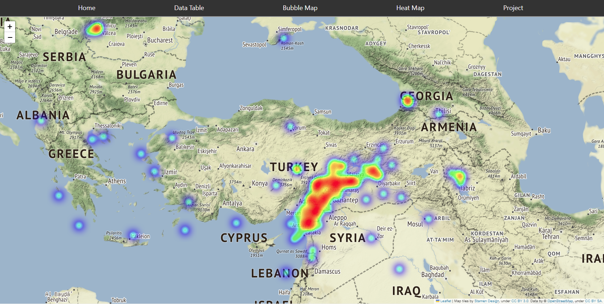

# Turkey Earthquake Monitoring and Analysis System

### May God bless Turkish and Syrian people! And all the lucks go to the rescuers.


Project: **TEMAS** - **T**urkey **E**arthquake **M**onitoring and **A**nalysis **S**ystem

Latest Version: 2.0.0  |  Released: September 2026  |  by: marcuz-apl

## Project Features

* **Real-Time Seismic Ingestion**: Asynchronously fetches earthquake events from Kandilli Observatory (KOERI) with automatic background sync every 3 minutes.
* **Preserved Historical Record**: Retains the complete, precious dataset from the February 2023 Kahramanmaraş earthquake sequence onwards.
* **Decoupled Architecture**: High-performance Python FastAPI backend + modern Single Page Application (zero iframes).
* **Interactive Geospatial Intelligence**: Vector Leaflet map with CartoDB Dark Matter tiles, logarithmic energy-scaled epicenters, fault line overlays (PB2002), and live magnitude filtering.
* **Exportable Intelligence**: Instant one-click CSV and GeoJSON export for researchers and observers.
* **Alfazen Versioning**: Adopts `versioning-alfazen` protocol with automated Git hooks.

## Toolsets

```text
1. Backend: Python 3.11+ / FastAPI / Uvicorn / Async HTTPX
2. Persistence: SQLite with WAL mode and B-Tree indexing
3. Frontend: Modern ESM / Leaflet.js / CartoDB Dark Matter / CSS Glassmorphism
4. DevOps: Docker / Docker Compose (port 4070)
```

## Quickstart

### Option 1: Docker Compose (Recommended)

```bash
docker compose up -d --build
```
Open **http://localhost:4070** in your browser.

### Option 2: Local Python Environment

```bash
python3 -m venv .venv
source .venv/bin/activate
pip install -r requirements.txt

# Run server on port 4070
uvicorn backend.main:app --host 0.0.0.0 --port 4070
```
Open **http://localhost:4070** in your browser.

1. **Docker-Pull** method:

   1A) pull down the very Docker image:

   ```shell
   docker pull marcuszou/temas:0.8.0
   ```

   1B) run the docker image into a container while mapping "**./web**" folder on host to "**/app**" folder in the Docker container:

   ```bash
   docker run -d -p 8001:80 --name "TEMAS-0.8.0" -v ./web:/app -t temas:0.8.0
   ```
   
   1C) then you can launch a web browser to browse to - http://localhost:8001 to enjoy the project.

   

   **Note**: the web server and job runner (the daily scrapper) have been configured such that everything is running smoothly and automatically unless you shut down the docker container.

   

3. **Fork-n-Dock** method:
   
   3A) Clone the very repo:
   
   ```
   git clone https://github.com/marcuz-apl/temas.git
   ```
   
   3B) enter into the project folder and build a docker image:
   
   ```
   cd temas-main
   docker build --no-cache -t mytemas .
   ```
   
   3C) Run the docker image into a container:
   
   ```
   docker run -d -p 8001:80 --name "TEMAS" -v /web:/app -t mytemas
   ```
   
   3D) then you can launch a web browser to browse to - http://localhost:8001 to enjoy the project.

## Special Technical Report when Dockerizing the Project

 You may fork my project to your own space to play around and there are some observations to be noted as below:

* The small-sized `alpine` variant of Python docker images are kinda problematic due to (1) not updating Python to 3.10.6, but 3.10.0 and (2) lack of some core libraries leading to unable to install the `pandas` library (which is unbearable).

* Then the best smaller docker image shall be: `Python-3.10.6-slim` (45 MB only for downloading), which need you to schedule the `cron` job on the host though. 

* Eventually we are able to run the cron job within nginx Docker container, which ease our tasks extremely.

  

## Versions

* v0.8.0 build 2023-03-17 - Dockerfile tuned and nginx docker container added. Schedule the app-updater.py on the Host.

* v0.7.2 build 2023-03-13 - Changes on the job scheduler, .ignore files and finalizing. Pushed to github and cloud.

* v0.7.1 build 2023-03-12 - Scheduled a Data Updater and dockerized the project into a cloud service.

* v0.7.0 build 2023-03-11 - Tried to add Choropleth map, but lack of decent geojson file, re-org the project files and folders.

* v0.6.0 build 2023-03-10 - Split the jobs and Bootstrapped a landing page and other pages for the project.

* v0.5.0 build 2023-03-09 - Organized the all-in-one Jupyter Notebook: db-reader + scrapper + merger + mapper.

* v0.4.1 build 2023-03-08 - Scraping the multiple pages from sc3.koeri.boun.edu.tr/events/events{i}.html was successful.

* v0.4.0 build 2023-03-07 - Scraping the first page from sc3.koeri.boun.edu.tr/events/events.html was successful.

* v0.3.0 build 2023-03-04 - Created a SQLite3 db and saved the dataframe of Historic data into it.

* v0.2.1.build.2023-02-27 - Merged Historic and real-time data into one local dataframe.
* v0.2.0.build.2023-02-26 - Historic dataset added (from 16 Jan 2023).
* v0.1.0.build.2023-02-13 - First release - current 500 datapoints only.

## Live Earthquake Maps

* Bubble Map


* Heat Map



## Credits

[KANDiLLi OBSERVATORY AND EARTHQUAKE RESEARCH INSTITUTE (1868)](http://www.koeri.boun.edu.tr/new/en)

[KANDiLLi Observatory Interactive Earthquake Map](http://udim.koeri.boun.edu.tr/zeqmap/)

This project is for educational purposes only. The copyrights of the data and values are exclusively owned by Boğaziçi University and Kandilli Observatory.

