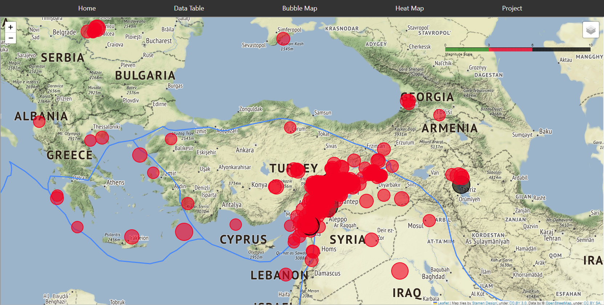
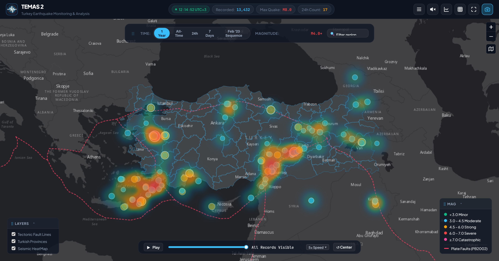

# Turkey Earthquake Monitoring and Analysis System (TEMAS)

### *May God bless Turkish and Syrian people! And all the lucks go to the rescuers.*

---

**TEMAS** (**T**urkey **E**arthquake **M**onitoring and **A**nalysis **S**ystem) is a high-availability, real-time seismic observatory platform and historical earthquake catalog for Turkey, Syria, and the Aegean/East Mediterranean seismic zones. 

Founded following the devastating February 6, 2023 Kahramanmaraş earthquake sequence, TEMAS bridges the gap between public seismic awareness and rigorous geoscientific analysis.

- **Current Release**: `v2.10.7` (September 2026)
- **Author & Copyright**: © 2023–2026, Alfazen Inc. / marcuz-apl
- **License**: Educational & Open Scientific Use (Data copyright Boğaziçi Univ. / KOERI)

---

## Key System Capabilities

- **Resilient Multi-Source Ingestion**: Asynchronously aggregates seismic feeds across three redundant tiers:
  1. **KOERI** (*Boğaziçi University Kandilli Observatory*) — Primary local Turkish network.
  2. **EMSC-CSEM** (*Euro-Med Seismological Centre*) — Secondary FDSN regional network.
  3. **USGS** (*United States Geological Survey*) — Tertiary global teleseismic network.
- **Continuous 2021–2026 Historical Archive**: Over **13,400 verified earthquake records** (M ≥ 2.0) permanently persisted and indexed in SQLite with zero cloud dependencies.
- **Adaptive Timeline Playback & 1-Year Default Scope**: Defaults to the past 12 months (~1,600 events) for an instantaneous, lightweight initial paint, with an on-demand `All-Time` mode that streams the full 2021–2026 multi-year archive. Chronological animation seamlessly adapts to whichever temporal filter is active.
- **Full-Spectrum Day/Night Theme Synchronization**: One-click basemap toggle alternates between CartoDB Dark Matter and OpenStreetMap Light, dynamically syncing header glassmorphism, floating filter toolbars, timeline scrubbers, and corner dock panels.
- **Seismological Noise Purge**: Automatically discards sub-threshold micro-tremors (M < 2.0) during ingestion to eliminate storage bloat and focus on actionable civil protection events.
- **Schema-Enforced Deduplication**: Deterministic window partitioning and composite unique constraints (`uq_quaketk_event`) prevent duplicate event ingestion across multi-agency feeds.
- **Hardened Administrative Operations Deck**:
  - Concealed route architecture with deceptive HTTP 404 responses for unauthorized `/admin` probes.
  - Real-time client-side sync telemetry popups with provider-level round-trip latency cards.
  - Multi-vector catalog filtering (by **Measurement Source**, **Magnitude Scale**, and **Region**).
  - Deterministic table pagination (`⏮ First`, `◀ Prev`, `Next ▶`, `Last ⏭`).
  - WAL database checkpointing (`PRAGMA wal_checkpoint(TRUNCATE)`) and B-Tree defragmentation (`VACUUM`).
  - Dynamic runtime passkey management and interactive mission-control About manifest.
- **Interactive Public Geospatial Map**:
  - Zero-iframe responsive Single Page Application with GPU-accelerated Leaflet HTML5 Canvas rendering.
  - Logarithmic energy-scaled hypocenters and depth color-coding.
  - Active tectonic fault line overlays (PB2002 plate boundary model) and provincial administrative boundaries.
  - Mobile-first dual-navigation header (Left Feed Drawer + Right 9-Dot Bento Tools Grid).
  - Symmetrical floating corner docks (Layers & Magnitude Legend) with 30-second idle auto-collapse and edge peek.
  - One-click dataset export to CSV and GeoJSON.
- **Alfazen Versioning**: Managed under `versioning-alfazen` with automated Conventional Commits semantic bumping.

---

## Technology Stack

| Layer | Technologies |
| :--- | :--- |
| **Backend** | Python 3.11+, FastAPI, Uvicorn, Async HTTPX, AnyIO |
| **Database** | SQLite3 in Write-Ahead Logging (WAL) mode with multi-column B-Tree indexes |
| **Frontend** | Vanilla ESM JavaScript, Semantic HTML5, CSS Glassmorphism, Leaflet.js (Canvas Mode) |
| **Mapping & GIS** | CartoDB Dark Matter, OpenStreetMap Standard, PB2002 Plate Boundaries GeoJSON, Turkey Province Boundaries |
| **DevOps** | Docker, Docker Compose, Automated Git Versioning Hooks |

---

## Quickstart

### Option 1: Docker Compose (Recommended)

```bash
# Clone the repository
git clone https://github.com/marcuz-apl/temas.git
cd temas

# Build and start the container in background
docker compose up -d --build
```
Access the application:
- **Public Map & Spatial Dashboard**: [http://localhost:4070](http://localhost:4070)
- **Admin Operations Deck (Authorized Operators)**: Mounted on an obfuscated route for botnet shielding. Refer to [TECHNOTE-03](docs/technote-03-security-and-administrative-operations.md) for deployment access instructions.

---

### Option 2: Local Python Environment

```bash
# 1. Create and activate Python virtual environment
python3 -m venv .venv
source .venv/bin/activate

# 2. Install dependencies
pip install -r requirements.txt

# 3. Launch Uvicorn ASGI server
uvicorn backend.main:app --host 0.0.0.0 --port 4070 --reload
```
Open **http://localhost:4070** in your browser.

---

## Administrative Operations Deck

The Operations Deck provides administrative oversight, manual event injection, provider failover control, and database maintenance:

### Security & Route Concealment Balance
In compliance with observatory security best practices, the administrative deck balances operational convenience with botnet defense:
- **Concealed Route**: To shield the deck from automated internet crawlers, vulnerability scanners, and dictionary attacks, the administrative console is mounted on an obfuscated path.
- **Deceptive 404 Decoy**: Requests probing conventional paths (such as `/admin`) receive an intentional `404 Not Found` response, concealing the presence of administrative functionality.
- **Dynamic Passkey Authentication**: Access is guarded by a session-authenticated passkey that can be dynamically updated by operators directly from the command bar, persisting in SQLite without server restarts.
- **Zero Public Hyperlinks**: No public visitor pages or search sitemaps advertise administrative paths.

> [!NOTE]
> **Authorized Operator Documentation**:
> Full configuration details, default setup credentials, and route access instructions are documented in the internal engineering manual:  
> 📖 **[TECHNOTE-03: Security Architecture & Administrative Operations](docs/technote-03-security-and-administrative-operations.md)**

- **Configurable Cadence**: Upstream background sync interval defaults to 180 seconds and can be adjusted via:
  ```bash
  export TEMAS_SYNC_INTERVAL=300  # Sets 5-minute sync cadence
  ```

---

## Technical Documentation & Architecture Notes

Detailed architectural rationale, seismological design considerations, and operational protocols are documented in the [`docs/`](docs/) directory:

- **[Milestone Changelog (`docs/CHANGELOG.md`)](docs/CHANGELOG.md)**: Full semantic progression from the 2023 prototypes (`v0.1.0`) to the modern platform (`v2.10.7`).
- **[TECHNOTE-01: Ingestion Cadence & Upstream Courtesy](docs/technote-01-data-ingestion-and-polling-strategy.md)**: Seismological wave arrival delays, solver latencies, and provider fair-use policies.
- **[TECHNOTE-02: Catalog Hygiene & Storage Optimization](docs/technote-02-seismic-catalog-hygiene-and-storage.md)**: Noise filtering cut-off (M < 2.0), multi-agency deduplication, and SQLite WAL checkpointing.
- **[TECHNOTE-03: Security & Operator Ergonomics](docs/technote-03-security-and-administrative-operations.md)**: Concealed route architecture (`/samet`), dynamic authentication, and client-side mission-control telemetry.

---

## Historical Prototype Notes (2023 Inception Series)

During initial proof-of-concept development in February–March 2023, TEMAS was tested under early containerized environments:

<details>
<summary>Click to expand Legacy Docker & Containerization Observations</summary>

- The lightweight `alpine` Python variants encountered compilation issues with `pandas` in early 2023, leading to the adoption of `python:3.10-slim`.
- The original prototype ran a daily cron scraper inside an Nginx container on port `8001`.
- These legacy proof-of-concept scripts have been retired, with all operations consolidated into the unified async FastAPI architecture on port `4070`.
</details>

---

## Live Earthquake Maps

### Real-Time Epicenter Map


### Seismic Intensity Heat Map


---

## Credits & Acknowledgments

- **[Kandilli Observatory and Earthquake Research Institute (KOERI, 1868)](http://www.koeri.boun.edu.tr/new/en)** — Boğaziçi University
- **[European-Mediterranean Seismological Centre (EMSC-CSEM)](https://www.emsc-csem.org/)**
- **[United States Geological Survey (USGS)](https://earthquake.usgs.gov/)**
- **[Peter Bird (PB2002)](https://peterbird.name/oldFTP/PB2002/)** — Global Tectonic Plate Boundaries

*This project is dedicated to educational, humanitarian, and open scientific research. The copyrights and intellectual property of seismic observations belong to their respective originating institutions.*
